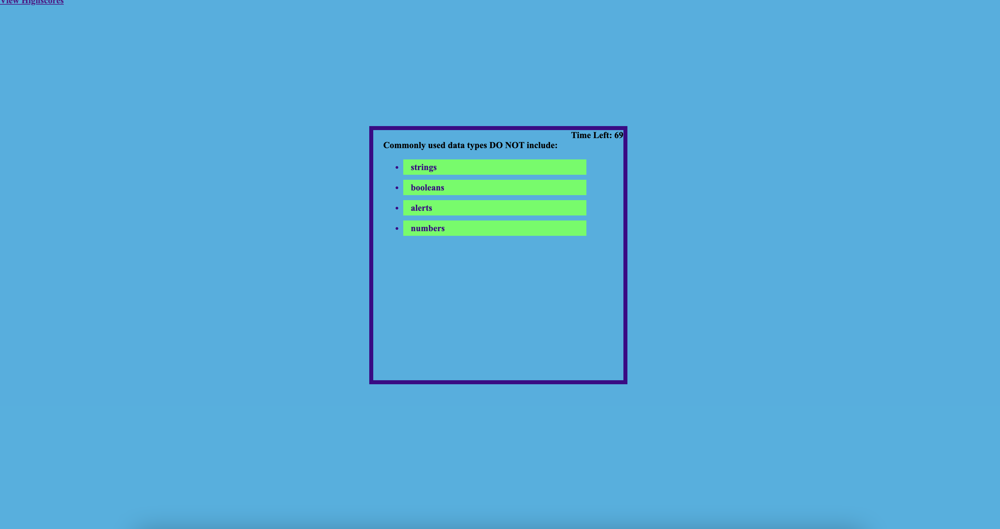

<h1>Code Quiz</h1>
<h2>Description<h2>

<ol>
<li>GIVEN I am taking a code quiz</li>
<li>WHEN I click the start button</li>
<li>THEN a timer starts and I am presented with a question</li>
<li>WHEN I answer a question</li>
<li>THEN I am presented with another question</li>
<li>WHEN I answer a question incorrectly</li>
<li>THEN time is subtracted from the clock</li>
<li>WHEN all questions are answered or the timer reaches 0</li>
<li>THEN the game is over</li>
<li>WHEN the game is over</li>
<li>HEN I can save my initials and my score</li>
</ol>

<h2>Project Status</h2>

In the process.

;
;
;
;
;